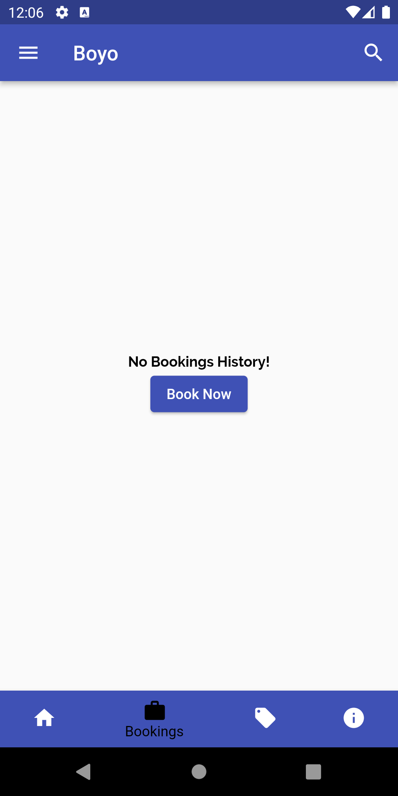
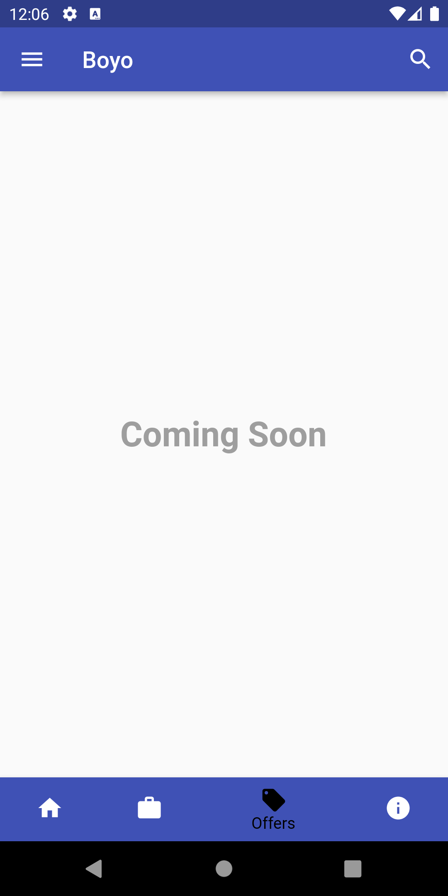
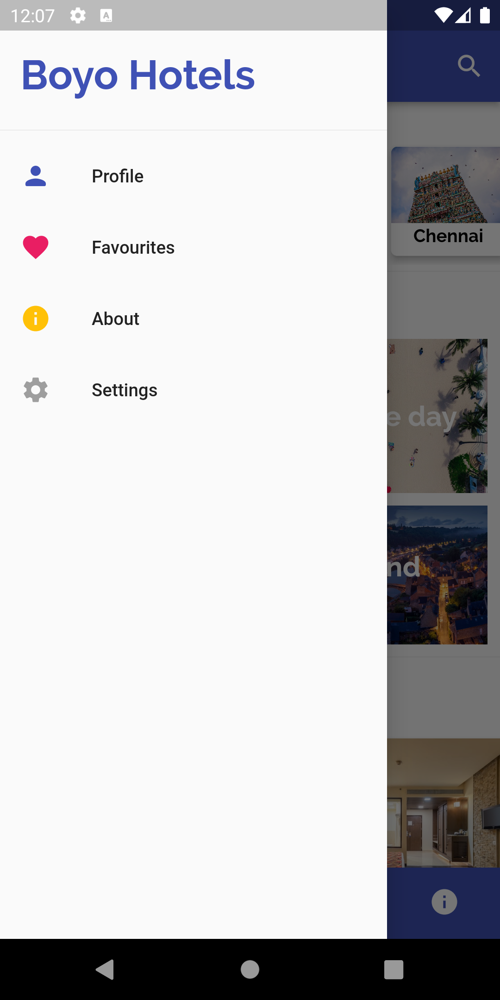
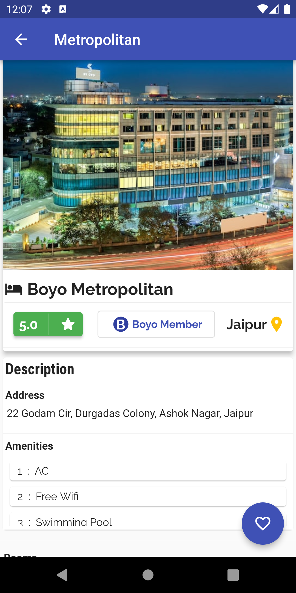
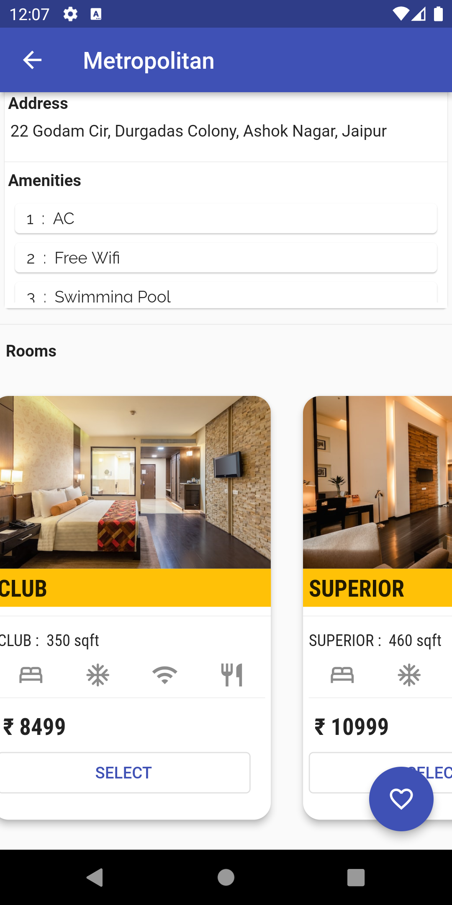
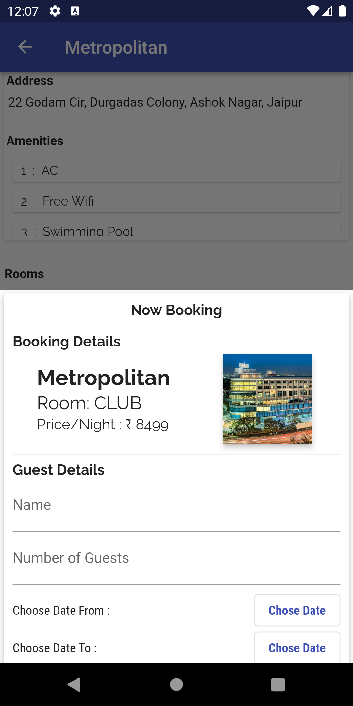
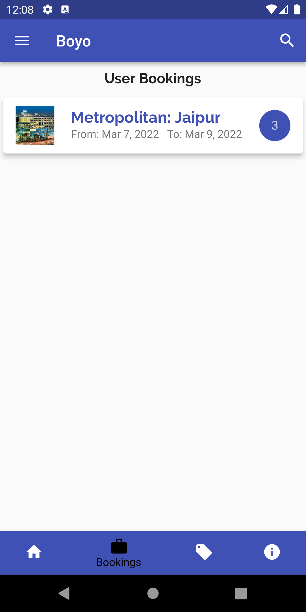
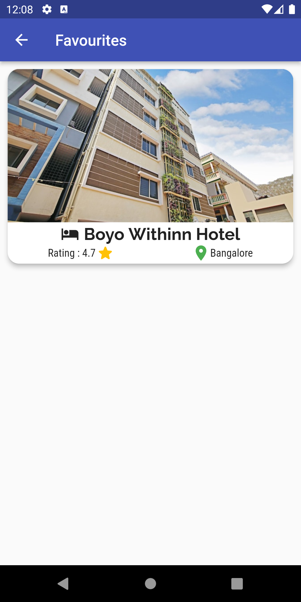

# Boyo Hotels

A simple Hotel booking app built in similarity with Oyo app (as the name itself gives a hint) with a cleaner UI.

## Key Points

- Built with **Flutter & Dart** on the frontend using **Material UI**
- Similar screen layout as that of Oyo app with features like Booking Hotel, displaying User Bookings, marking Hotels as Favourites & much more coming soon
- Made with an aim to incoperate various **Flutter Widgets** & display proficiency in Flutter & Dart internals

## ScreenShots

 |  |   |
 | 
---
 |  |  |
 | 

## Created & Maintained by

### **Amartya Yadav**
---
